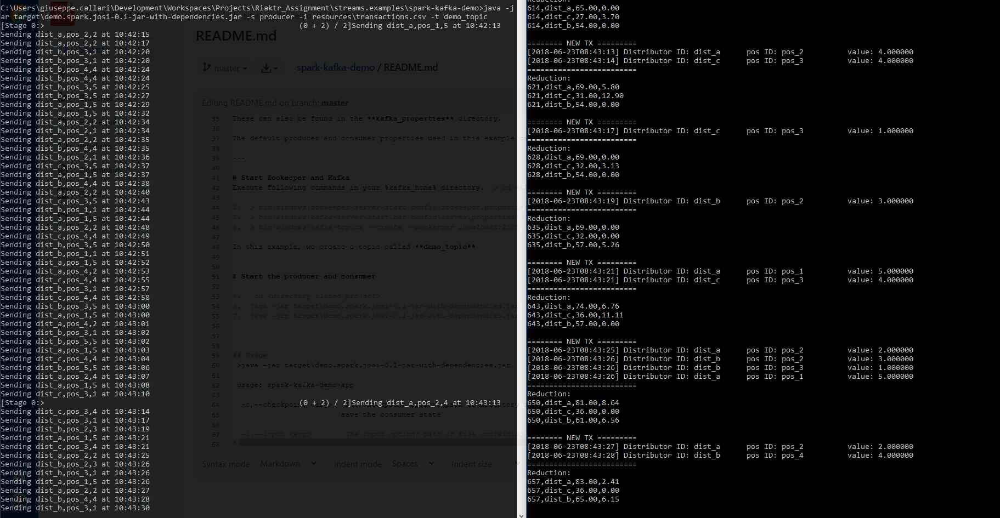
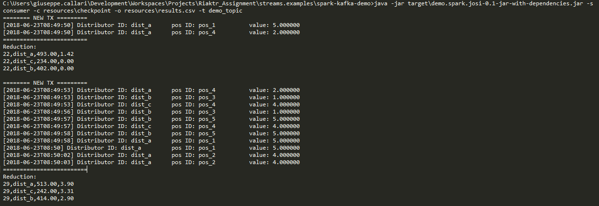
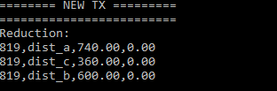

# Processing transactions using Kafka, Spark and Avro

This Java example how to produce and consume data to and from Kafka. Data is serialized and deserialized using Avro. Apache Spark is used to process the data before sending it to and when reading from the Kafka data stream.
The use case in this example is the processing of transactions. These are sent to a Kafka stream using random intervals (max. 5 seconds). Another process calculates the sum per distributor over a 3 second window and stores the ongoing accumulation in another file.
This process should pick up where it left off in case it crashes and needs to restart.

## Resources

The **resources** directory contains the following files:

1. ***transactions.csv***: the transactions
2. ***assignment.pdf***: the complete assignment
3. ***output.csv***: an output example

This project is built and packaged using Maven 3.3.9.
The **target** directory contains a jar including all dependencies: ´demo.spark.josi-0.1-jar-with-dependencies´
To generate the jar, execute the following Maven command in the cloned directory: 
´mvn clean compile assembly:single´

The **src/main/java/myapp** directory contains four .java files:

1. ***App.java***: contains UI-logic
2. ***MyAvroSparkProducer.java***: implementation of the producer
3. ***MyAvroSparkConsumer.java***: implementation of the consumer
4. ***Util.java***: A utility class containing the used Avro schema

## Prerequisites
- Java 8 (or higher)
- For Windows users: install the hadoop winutils and [add them to your class path](https://stackoverflow.com/questions/18630019/running-apache-hadoop-2-1-0-on-windows)
- [A Kafka installation (1.1.0) ](https://kafka.apache.org/quickstart)

The **pom.xml** contains all Java dependencies. This manual assumes the user runs the examples in a Windows (10) environment. If you use another OS, I refer you to the Kafka documentations for the correct commands to setup your Kafka server.

Before running the example, make sure that Zookeeper and Kafka. In what follows, we assume that Zookeeper, Kafka and Schema Registry are started with the default settings. 
These can also be found in the **kafka_properties** directory.

The default producer and consumer properties used in this example can be found in **src\main\resources** 

---

# Start Zookeeper and Kafka
Execute following commands in your %kafka_home% directory. `> cd %KAFKA_HOME% `

2. `> bin\windows\zookeeper-server-start config\zookeeper.properties` (in a seperate shell)
3. `> bin\windows\kafka-server-start.bat config\server.properties` (in a seperate shell)
4. `> bin\windows\kafka-topics --create --zookeeper localhost:2181 --replication-factor 1 --partitions 1 --topic demo_topic`

In this example, we create a topic called **demo_topic**

# Start the producer and consumer

5.  `cd <directory cloned project>`
6. `java -jar target\demo.spark.josi-0.1-jar-with-dependencies.jar -s consumer -c resources\checkpoint -o resources\results.csv -t demo_topic` (in a seperate shell)
7. `java -jar target\demo.spark.josi-0.1-jar-with-dependencies.jar -s producer -i resources\transactions.csv -t demo_topic ` (in a seperate shell)

**resources\checkpoint** is a path to a non-existent folder which will be created in run time. The consumer will store its state in the checkpoint folder. If the process is killed and restarted with the same checkpoint folder,
it will pick up where it left off.

# Screenshots
 
 
### Example output
 

 
### Restart consumer
 

 
 
### Final state (all txs consumed)
 

# Usage
`>java -jar target\demo.spark.josi-0.1-jar-with-dependencies.jar`

`usage: spark-kafka-demo-app`

 `-c,--checkpoint <arg>   The checkpoint option: path of directory used to
                         save the consumer state`
                         
 `-i,--input <arg>        The input option: path of file containing the
                         transactions`
                         
 `-o,--output <arg>       The output option: path of file used to save the
                         aggregations`
 `-p,--properties <arg>   The properties option: path of file containing
                         additional streaming properties to overwrite
                         default consumer or producer properties`
                         
 `-s,--type <arg>         The stream type option - possible tyes:
                         'consumer','producer'`
                         
 `-t,--topic <arg>        The topic option: a kafka topic`
 
 

